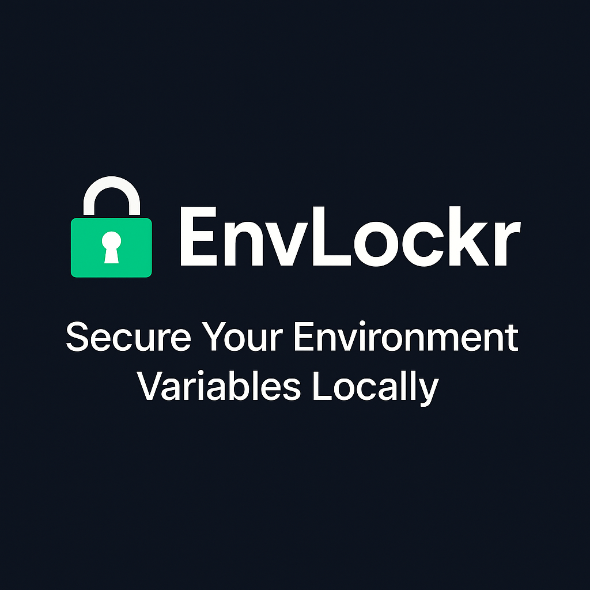

<p align="center">
  
</p>

# 🔐 EnvLockr CLI

[](https://pypi.org/project/envlockr/)
[](https://github.com/RohanRatwani/envlockr-cli/actions/workflows/ci.yml)
[](https://opensource.org/licenses/MIT)
[](https://www.python.org/downloads/)
[](https://github.com/RohanRatwani/envlockr-cli/stargazers)

> Secure your environment variables — locally, encrypted, and stream-safe.

EnvLockr CLI is a tool for developers, streamers, and indie hackers who want full control of their secrets without relying on cloud services.

## ✨ Features

- **Local-first**: All secrets stored securely on your machine
- **AES Encryption**: Protects your secrets even if your disk is compromised
- **Offline Mode**: No internet needed to operate
- **Stream-Safe**: No .env file leaks on screen while coding or streaming
- **Simple CLI**: Add, copy, list, and retrieve secrets instantly
- **Cross-Project Friendly**: Works with React, Node.js, Python, and more
- **GitHub Action**: Automatically scan commits for exposed secrets ([Learn more](GITHUB_ACTION.md))

## 🚀 Quick Start

### 1. Install

```bash
# Install from PyPI (recommended)
pip install envlockr

# With clipboard support
pip install envlockr[clipboard]
```

<details>
<summary>Alternative: Install from source</summary>

```bash
git clone https://github.com/RohanRatwani/envlockr-cli.git
cd envlockr-cli
pip install -e .
```
</details>

### 2. Commands

| Command | Example | What it Does |
|---------|---------|-------------|
| add | `envlockr add STRIPE_KEY` | Add a new secret |
| get | `envlockr get STRIPE_KEY` | Retrieve a secret |
| list | `envlockr list` | List all stored secrets |
| copy | `envlockr copy STRIPE_KEY` | Copy secret to clipboard |
| update | `envlockr update STRIPE_KEY` | Update an existing secret |
| delete | `envlockr delete STRIPE_KEY` | Delete a secret |
| export | `envlockr export --output .env` | Export all secrets to .env file |
| import | `envlockr import .env` | Import secrets from .env file |
| encrypt-vault | `envlockr encrypt-vault` | Password-protect your vault for backup |
| decrypt-vault | `envlockr decrypt-vault` | Restore a password-protected vault |
| export-vault | `envlockr export-vault` | Export vault for team sharing |
| import-vault | `envlockr import-vault` | Import a shared vault file |
| --version | `envlockr --version` | Show version number |
## ⚡ How to Use in Your Projects

### 🖥 Node.js / React / Vite / Next.js

#### Option 1: Export to .env file

```bash
envlockr export --output .env
npm run dev
```

#### Option 2: Inline Injection (no .env needed)

```bash
export STRIPE_KEY=$(envlockr get STRIPE_KEY)
npm run dev
```

#### Option 3: Import existing .env file

```bash
# Migrate your existing .env to encrypted storage
envlockr import .env
rm .env  # Delete the unencrypted file
```

### 🛠 Compatible with

- create-react-app
- Next.js
- Vite
- Remix
- Express
- NestJS
- and more!

👉 **[See framework-specific examples](EXAMPLES.md)** - React, Next.js, Python, Docker, and more!

## 📦 Local Storage

All your secrets are encrypted and stored in:

```
~/.envlockr/vault.json
~/.envlockr/key.key
```

- ✅ AES-256 level security
- ✅ No external cloud or server dependency

## 🔍 GitHub Action - Prevent Secret Leaks

EnvLockr includes a **GitHub Action** that automatically scans your repository for exposed secrets!

### Quick Setup

Add this to `.github/workflows/envlockr-scan.yml`:

```yaml
name: EnvLockr Secret Scan
on: [pull_request, push]

jobs:
  scan:
    runs-on: ubuntu-latest
    steps:
      - uses: actions/checkout@v4
      - name: Scan for secrets
        run: |
          curl -sSL https://raw.githubusercontent.com/RohanRatwani/envlockr-cli/main/.github/scripts/scan-secrets.sh | bash
```

**What it does:**
- ✅ Scans commits for API keys, tokens, and passwords
- ✅ Blocks PRs if secrets are detected
- ✅ Posts helpful comments with fix instructions
- ✅ Detects AWS, Stripe, GitHub, Google, OpenAI, and more

👉 [Full GitHub Action Documentation](GITHUB_ACTION.md)

## 💬 Why EnvLockr?

- 🔒 **Protect your keys** without trusting the cloud
- 🎥 **Stream coding sessions** without leaking environment secrets
- ⚡ **Speed up local development** with simple, fast secret management

## 📚 Documentation

- **[Quick Reference Guide](QUICKSTART.md)** - Common commands and workflows
- **[Framework Examples](EXAMPLES.md)** - React, Next.js, Python, Node.js, Docker
- **[GitHub Action Setup](GITHUB_ACTION.md)** - Prevent secret leaks in CI/CD
- **[Contributing Guide](CONTRIBUTING.md)** - Help improve EnvLockr
- **[Changelog](CHANGELOG.md)** - Version history

## 📥 What's Next?

We're exploring new features for EnvLockr, including:
- Advanced environment injection (`envlockr inject -- npm run dev`)
- Desktop UI app
- IDE integrations (VS Code, JetBrains)

👉 [Join the Waitlist](https://envlockr.dev) and share your thoughts!

## 💡 We Want Your Feedback!

Which features would you love to see in EnvLockr?  
- 💬 [GitHub Discussions](https://github.com/RohanRatwani/envlockr-cli/discussions)
- 🐛 [Report Issues](https://github.com/RohanRatwani/envlockr-cli/issues)
- 🌟 [Star us on GitHub](https://github.com/RohanRatwani/envlockr-cli)

## 🛡️ License

This project is licensed under the [MIT License](LICENSE).

---

<p align="center">
  Made with ❤️ by <a href="https://github.com/RohanRatwani">Rohan Ratwani</a>
  <br>
  <a href="https://envlockr.dev">Website</a> · 
  <a href="https://github.com/RohanRatwani/envlockr-cli">GitHub</a> · 
  <a href="https://twitter.com/techwithrohan">Twitter</a>
</p>
