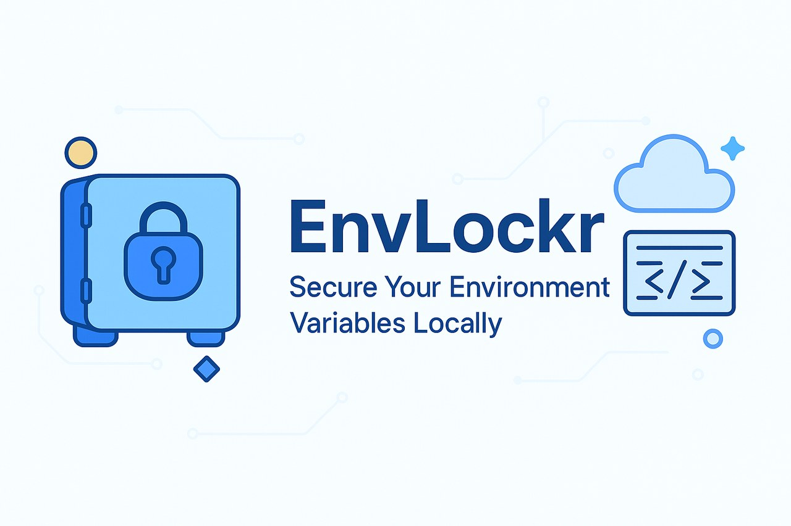
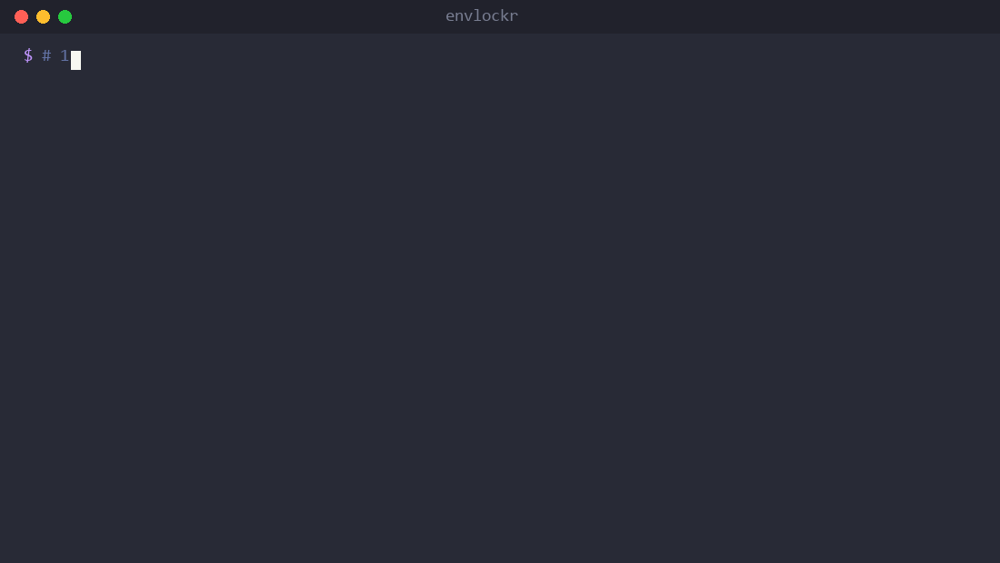

<p align="center">
  
</p>

# 🔐 EnvLockr CLI

[](https://pypi.org/project/envlockr/)
[](https://opensource.org/licenses/MIT)
[](https://www.python.org/downloads/)
[](https://github.com/RohanRatwani/envlockr-cli/stargazers)

> Secure your environment variables — locally, encrypted, and stream-safe.

EnvLockr CLI is a tool for developers, streamers, and indie hackers who want full control of their secrets without relying on cloud services.

<!-- Generate with `vhs demo.tape` (see DEMO.md), then uncomment:
<p align="center"></p>
-->

## ✨ Features

- **Local-first**: All secrets stored encrypted on your machine — no cloud, no account
- **Keychain-backed key**: The master key lives in your **OS keychain** (Windows Credential Manager / macOS Keychain / libsecret), *not* a plaintext file beside the vault — real protection if your disk is compromised
- **`run` injection**: `envlockr run -- npm run dev` injects secrets straight into the process — **no `.env` ever written to disk**
- **Liveness `verify`**: `envlockr verify` checks whether your stored keys are still live (Stripe, OpenAI, Anthropic, GitHub, Slack) — catch revoked/rotated keys
- **Profiles**: `--env prod` for isolated per-environment vaults
- **Offline Mode**: Core commands need no internet
- **Stream-Safe**: No `.env` on screen while coding or streaming
- **Cross-Project Friendly**: Works with React, Node.js, Python, and more
- **GitHub Action**: Scan commits for exposed secrets ([Learn more](GITHUB_ACTION.md))

## 🚀 Quick Start

### 1. Install

```bash
# Install from PyPI (recommended)
pip install envlockr

# Recommended: keychain-backed key + clipboard support
pip install "envlockr[keychain,clipboard]"
```

> 💡 Without the `keychain` extra, the master key falls back to a `0600` file on
> disk and EnvLockr warns you. Install the extra for real disk-compromise
> protection, then run `envlockr secure-key` to migrate an existing key.

<details>
<summary>Alternative: Install from source</summary>

```bash
git clone https://github.com/RohanRatwani/envlockr-cli.git
cd envlockr-cli
pip install -e .
```
</details>

### 2. Commands

| Command | Example | What it Does |
|---------|---------|-------------|
| add | `envlockr add STRIPE_KEY` | Add a new secret |
| get | `envlockr get STRIPE_KEY` | Retrieve a secret |
| list | `envlockr list` | List all stored secrets |
| copy | `envlockr copy STRIPE_KEY` | Copy secret to clipboard |
| update | `envlockr update STRIPE_KEY` | Update an existing secret |
| delete | `envlockr delete STRIPE_KEY` | Delete a secret |
| export | `envlockr export --output .env` | Export all secrets to .env file |
| import | `envlockr import .env` | Import secrets from .env file |
| run | `envlockr run -- npm run dev` | Run a command with secrets injected (no .env) |
| verify | `envlockr verify` | Check whether stored keys are still live |
| secure-key | `envlockr secure-key` | Move the master key into your OS keychain |
| encrypt-vault | `envlockr encrypt-vault` | Password-protect your vault for backup |
| decrypt-vault | `envlockr decrypt-vault` | Restore a password-protected vault |
| export-vault | `envlockr export-vault` | Export vault for team sharing |
| import-vault | `envlockr import-vault` | Import a shared vault file |
| --env | `envlockr --env prod list` | Use an isolated named profile |
| --version | `envlockr --version` | Show version number |

> By default `add` prompts securely (hidden input). For scripts and CI, pass the
> value non-interactively:
> ```bash
> envlockr add API_KEY --value "$API_KEY" --force      # from a variable
> printf '%s' "$API_KEY" | envlockr add API_KEY --stdin # from stdin (no shell history)
> ```

## ⚡ How to Use in Your Projects

### 🖥 Node.js / React / Vite / Next.js

#### Option 1 (recommended): `run` — inject secrets, no file on disk

```bash
envlockr run -- npm run dev
```

All your secrets are injected into the process environment. Nothing is written
to disk, so there is no `.env` to accidentally commit or leak on stream.

#### Option 2: Export to .env file

```bash
envlockr export --output .env
npm run dev
```

#### Option 3: Inline Injection of a single value

```bash
export STRIPE_KEY=$(envlockr get STRIPE_KEY)
npm run dev
```

#### Option 3: Import existing .env file

```bash
# Migrate your existing .env to encrypted storage
envlockr import .env
rm .env  # Delete the unencrypted file
```

### 🛠 Compatible with

- create-react-app
- Next.js
- Vite
- Remix
- Express
- NestJS
- and more!

👉 **[See framework-specific examples](EXAMPLES.md)** - React, Next.js, Python, Docker, and more!

## 📦 Local Storage & Security Model

Your secret **values** are encrypted with Fernet (AES-128-CBC + HMAC) and stored in:

```
~/.envlockr/vault.json        # encrypted secret values
```

The **master key** is stored in one of two places:

- **OS keychain** (when `envlockr[keychain]` is installed) — the key never
  touches the filesystem, so reading `vault.json` alone is useless to an attacker.
- **`~/.envlockr/key.key`** (`0600`) as a fallback when no keychain is available.
  In this mode the key sits next to the vault, so disk access = full access —
  EnvLockr warns you and you can upgrade with `envlockr secure-key`.

For backups and team sharing, `encrypt-vault` bundles the vault + key behind a
password using **PBKDF2-HMAC-SHA256 (600k iterations) with a random per-file salt**.

- ✅ No external cloud or server dependency
- ✅ Honest about where the key lives — no false "uncrackable" claims

## 🔍 GitHub Action - Prevent Secret Leaks

EnvLockr includes a **GitHub Action** that automatically scans your repository for exposed secrets!

### Quick Setup

Add this to `.github/workflows/envlockr-scan.yml`:

```yaml
name: EnvLockr Secret Scan
on: [pull_request, push]

jobs:
  scan:
    runs-on: ubuntu-latest
    steps:
      - uses: actions/checkout@v4
      - name: Scan for secrets
        run: |
          curl -sSL https://raw.githubusercontent.com/RohanRatwani/envlockr-cli/main/.github/scripts/scan-secrets.sh | bash
```

**What it does:**
- ✅ Scans commits for API keys, tokens, and passwords
- ✅ Blocks PRs if secrets are detected
- ✅ Posts helpful comments with fix instructions
- ✅ Detects AWS, Stripe, GitHub, Google, OpenAI, and more

👉 [Full GitHub Action Documentation](GITHUB_ACTION.md)

## 🆚 How EnvLockr is different

There are great tools in this space — EnvLockr fills the gaps they leave:

| | EnvLockr | dotenvx | SOPS | gitleaks |
|---|---|---|---|---|
| Key off-disk (OS keychain) | ✅ | ❌ (`.env.keys` on disk) | ⚠️ external KMS/age setup | n/a |
| Run cmd with no `.env` written | ✅ `run --` | ⚠️ decrypts to env, needs config | ❌ | n/a |
| Check if stored keys are still **live** | ✅ `verify` | ❌ | ❌ | ❌ |
| Zero-config, single command | ✅ | ⚠️ multi-step workflow | ❌ steep | ✅ (scan only) |
| Manages secrets *and* scans for leaks | ✅ | ❌ (manager only) | ❌ | ❌ (scanner only) |

- **vs dotenvx** — dotenvx keeps the decryption key in a `.env.keys` file on disk;
  EnvLockr puts it in your OS keychain and can run your app with **nothing written to disk**.
- **vs gitleaks/trufflehog** — those are scanners, not managers. trufflehog can
  verify secrets it *finds by scanning*; EnvLockr's `verify` does that for the
  vault you actively manage — plus it gives you a place to put the secrets
  (and wraps gitleaks for scanning when present).
- **vs SOPS/Vault** — no KMS, no server, no YAML — one `pip install` and you're running.

## 💬 Why EnvLockr?

- 🔒 **Protect your keys** without trusting the cloud
- 🎥 **Stream coding sessions** without leaking environment secrets
- ⚡ **Speed up local development** with simple, fast secret management

## 📚 Documentation

- **[Quick Reference Guide](QUICKSTART.md)** - Common commands and workflows
- **[Framework Examples](EXAMPLES.md)** - React, Next.js, Python, Node.js, Docker
- **[GitHub Action Setup](GITHUB_ACTION.md)** - Prevent secret leaks in CI/CD
- **[Contributing Guide](CONTRIBUTING.md)** - Help improve EnvLockr
- **[Changelog](CHANGELOG.md)** - Version history

## 📥 What's Next?

We're exploring new features for EnvLockr, including:
- Advanced environment injection (`envlockr inject -- npm run dev`)
- Desktop UI app
- IDE integrations (VS Code, JetBrains)

👉 [Join the Waitlist](https://envlockr.dev) and share your thoughts!

## 💡 We Want Your Feedback!

Which features would you love to see in EnvLockr?  
- 💬 [GitHub Discussions](https://github.com/RohanRatwani/envlockr-cli/discussions)
- 🐛 [Report Issues](https://github.com/RohanRatwani/envlockr-cli/issues)
- 🌟 [Star us on GitHub](https://github.com/RohanRatwani/envlockr-cli)

## 🛡️ License

This project is licensed under the [MIT License](LICENSE).

---

<p align="center">
  Made with ❤️ by <a href="https://github.com/RohanRatwani">Rohan Ratwani</a>
  <br>
  <a href="https://envlockr.dev">Website</a> · 
  <a href="https://github.com/RohanRatwani/envlockr-cli">GitHub</a> · 
  <a href="https://twitter.com/techwithrohan">Twitter</a>
</p>
