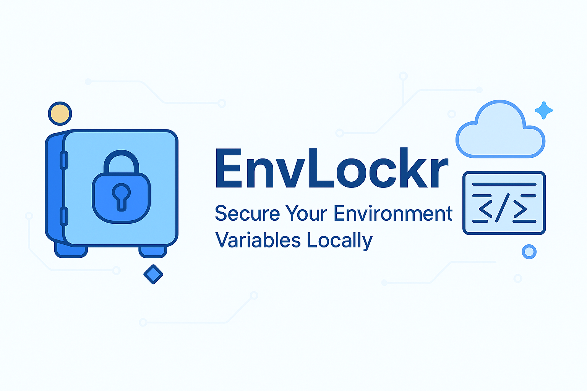

<p align="center">
  
</p>

# 🔐 EnvLockr CLI

> Secure your environment variables — locally, encrypted, and stream-safe.

EnvLockr CLI is a tool for developers, streamers, and indie hackers who want full control of their secrets without relying on cloud services.

## ✨ Features

- **Local-first**: All secrets stored securely on your machine
- **AES Encryption**: Protects your secrets even if your disk is compromised
- **Offline Mode**: No internet needed to operate
- **Stream-Safe**: No .env file leaks on screen while coding or streaming
- **Simple CLI**: Add, copy, list, and retrieve secrets instantly
- **Cross-Project Friendly**: Works with React, Node.js, Python, and more

## 🚀 Quick Start

### 1. Install

```bash
# Quick installation
pip install cryptography pyperclip
```

Or manually:

```bash
git clone https://github.com/RohanRatwani/envlockr-cli.git
cd envlockr-cli
pip install -r requirements.txt
```

### 2. Commands

| Command | Example | What it Does |
|---------|---------|-------------|
| add | `python envlockr.py add STRIPE_KEY` | Add a new secret |
| get | `python envlockr.py get STRIPE_KEY` | Retrieve a secret |
| list | `python envlockr.py list` | List all stored secrets |
| copy | `python envlockr.py copy STRIPE_KEY` | Copy secret to clipboard |
## ⚡ How to Use in Your Projects

### 🖥 Node.js / React / Vite / Next.js

#### Option 1: Export to .env file

```bash
python envlockr.py export --output .env
npm run dev
```

#### Option 2: Inline Injection (no .env needed)

```bash
export STRIPE_KEY=$(python envlockr.py get STRIPE_KEY)
npm run dev
```

### 🛠 Compatible with

- create-react-app
- Next.js
- Vite
- Remix
- Express
- NestJS
- and more!

## 📦 Local Storage

All your secrets are encrypted and stored in:

```
~/.envlockr/vault.json
~/.envlockr/key.key
```

- ✅ AES-256 level security
- ✅ No external cloud or server dependency

## 💬 Why EnvLockr?

- 🔒 **Protect your keys** without trusting the cloud
- 🎥 **Stream coding sessions** without leaking environment secrets
- ⚡ **Speed up local development** with simple, fast secret management

## ☕ Support the Project

If you find EnvLockr useful, you can support its development by [becoming a sponsor](https://github.com/sponsors/RohanRatwani).

## 📥 What’s Next?

We’re exploring new features for EnvLockr, including:
- Advanced environment injection
- Project-specific vaults

We’re also considering future enhancements like a desktop UI app or IDE/plugin integrations (e.g., VS Code)—let us know which would be more useful for your workflow!

👉 [Join the Waitlist](https://forms.gle/example) and share your thoughts!

## 💡 We Want Your Feedback!

Which features would you love to see in EnvLockr?  
Reply in [GitHub Issues](https://github.com/RohanRatwani/envlockr-cli/issues), join the waitlist, or reach out on Twitter!

## 🛡 License

This project is licensed under the [MIT License](LICENSE).
